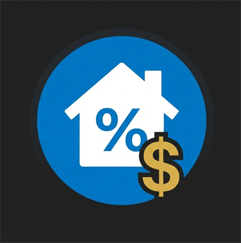

# 🏠 Konut Kredisi Hesaplama Uygulaması

Uygulama, konut kredisi hesaplamalarınızı en ince ayrıntısına kadar yapabilmeniz için geliştirilmiş, modern ve kullanıcı dostu bir masaüstü aracıdır. Karmaşık faiz hesaplamalarını saniyeler içinde yapar ve masrafları toplam maliyete dahil ederek size net bir sonuç sunar.

<p align="center">
  
</p>

---

## 🌟 Öne Çıkan Özellikler

### 💰 Detaylı Masraf Yönetimi
Sadece kredi taksitlerini değil, konut kredisi alırken karşılaşılan ek maliyetleri de hesaba katar:
- **Banka Tahsis Ücreti**
- **Ort. Ekspertiz Ücreti**
- **İpotek Ücreti**
Bu değerler toplam geri ödeme tutarına saniye bazında yansıtılır.

### 🛡️ Akıllı Giriş ve Doğrulama
Hatalı veri girişini engelleyen akıllı kontroller:
- **Binlik Ayırıcı:** Sayılar yazılırken otomatik olarak formatlanır (Örn: 1.500.000 TL).
- **Karakter Filtresi:** Sadece rakam girişi yapılabilir, harf ve semboller engellenir.
- **Limit Kontrolleri:** Vade için maksimum 240 ay (20 yıl), faiz için maksimum %99,99 gibi gerçekçi sınırlar barındırır.

### 🌑 Modern Koyu Tema (Dark Mode)
Göz alıcı ve profesyonel bir görünüm için tasarlanan **Karanlık Mod**, uzun süreli kullanımlarda göz yorgunluğunu en aza indirir. Tüm arayüz bu modern estetikle uyumludur.

---

## 📋 Giriş Alanları Rehberi

| Alan Adı | Açıklama | Limit / Format |
| :--- | :--- | :--- |
| **Ana Para (TL)** | Çekmek istediğiniz toplam kredi tutarı. | Max: 100.000.000 TL |
| **Aylık Faiz Oranı (%)** | Bankanın sunduğu aylık faiz oranı. Nokta/Virgül otomatik düzelir. | Max: %99,99 |
| **Vade (Ay)** | Krediyi geri ödeyeceğiniz toplam ay süresi. | Max: 240 Ay (20 Yıl) |
| **Banka Tahsis Ücreti** | Bankanın kredi tahsisi için aldığı sabit ücret. | Max: 100.000 TL |
| **Ort. Ekspertiz Ücreti** | Gayrimenkul değerlemesi için ödenen yaklaşık ücret. | Max: 100.000 TL |
| **İpotek Ücreti** | İpotek tesis işlemleri için ödenen resmi ücret. | Max: 100.000 TL |

---

## 🚀 Nasıl Kullanılır?

1. **Değerleri Girin:** Yukarıdaki alanları banka teklifinize göre doldurun.
2. **Hesapla:** Mavi renkli **"HESAPLA"** butonuna basın.
3. **Sonuçları İnceleyin:** 
   - **Aylık Taksit:** Her ay ödemeniz gereken net tutar.
   - **Toplam Ödeme:** Faizler ve tüm masraflar dahil cebinizden çıkacak toplam tutar.
   - **Toplam Faiz:** Kredinin ana para dışında oluşturduğu maliyet.

---

## 🛠️ Teknik Altyapı
- **Framework:** .NET 10.0 (WPF)
- **Dil:** C# 13.0
- **Mimari:** Clean Architecture (Cekirdek ve UI katmanları ayrılmıştır)
- **Mantık:** Bankacılık standartlarına uygun faiz hesaplama formülleri.

## 📥 Kurulum ve Çalıştırma

Projeyi yerel makinenizde çalıştırmak için .NET SDK yüklü olmalıdır:

```powershell
# Proje dizinine gidin
cd KrediHesaplama

# Uygulamayı çalıştırın
dotnet run --project KrediHesaplama.WpfUygulama/KrediHesaplama.WpfUygulama.csproj
```

---
*Bu proje modern .NET teknolojileri kullanılarak geliştirilmiştir.*
